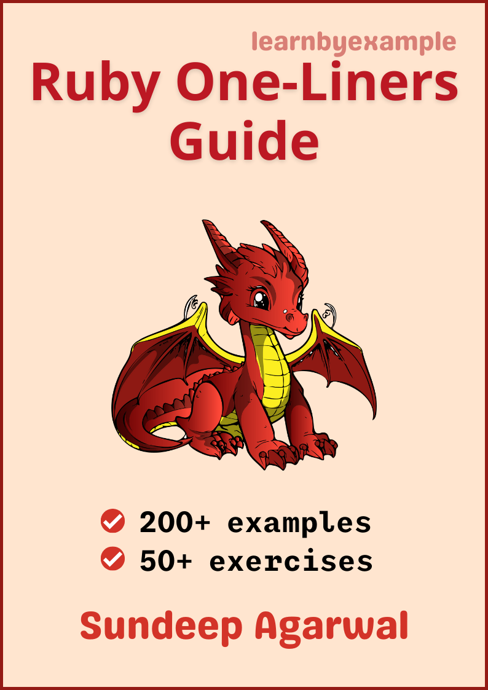

# Ruby one-liners cookbook

Example based guide for text processing with `ruby` from the command line.

    

The book also includes exercises to test your understanding, which is presented together as a single file in this repo - [Exercises.md](./exercises/Exercises.md)

For solutions to the exercises, see [Exercise_solutions.md](./exercises/Exercise_solutions.md).

See [Version_changes.md](./Version_changes.md) to keep track of changes made to the book.

 

# E-book

TODO

 

# Feedback

Please open an issue if you spot any typo/errors.

I'd also highly appreciate your feedback about the book.

Twitter: https://twitter.com/learn_byexample

 

# Table of Contents

1) Preface
2) One-liner introduction
3) Line processing
4) Field separators
5) Record separators
6) Multiple file input
7) Processing multiple records
8) Two file processing
9) Dealing with duplicates
10) Processing structured data

 

# Acknowledgements

* [ruby-lang documentation](https://www.ruby-lang.org/en/documentation/) — manuals and tutorials
* [/r/ruby/](https://www.reddit.com/r/ruby/) — helpful forum for beginners and experienced programmers alike
* [stackoverflow](https://stackoverflow.com/) — for getting answers to pertinent questions on Ruby, one-liners, etc
* [tex.stackexchange](https://tex.stackexchange.com/) — for help on `pandoc` and `tex` related questions
* [LibreOffice Draw](https://www.libreoffice.org/discover/draw/) — cover image
* [Warning](https://commons.wikimedia.org/wiki/File:Warning_icon.svg) and [Info](https://commons.wikimedia.org/wiki/File:Info_icon_002.svg) icons by [Amada44](https://commons.wikimedia.org/wiki/User:Amada44) under public domain
* [softwareengineering.stackexchange](https://softwareengineering.stackexchange.com/questions/39/whats-your-favourite-quote-about-programming) and [skolakoda](https://skolakoda.org/programming-quotes) for programming quotes

A heartfelt thanks to all my readers. Your valuable support has significantly eased my financial concerns and allows me to continue writing books.

 

# License

The book is licensed under a [Creative Commons Attribution-NonCommercial-ShareAlike 4.0 International License](https://creativecommons.org/licenses/by-nc-sa/4.0/)

The code snippets are licensed under MIT, see [LICENSE](./LICENSE) file

