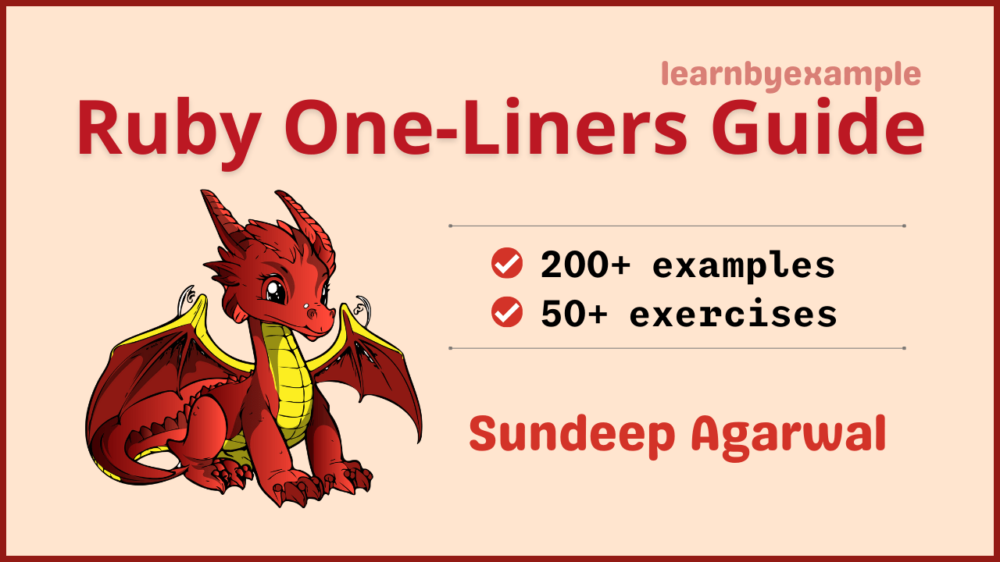

# Ruby One-Liners Guide

Example based guide for text processing with Ruby from the command line. Visit https://youtu.be/nsWVepZruws for a short video about the book.

The book also includes exercises to test your understanding, which are presented together as a single file in this repo — [Exercises.md](./exercises/Exercises.md).

For solutions to the exercises, see [Exercise_solutions.md](./exercises/Exercise_solutions.md).

See [Version_changes.md](./Version_changes.md) to keep track of changes made to the book.

 

# E-book

* You can purchase the pdf/epub versions of the book using these links:
    * https://learnbyexample.gumroad.com/l/ruby-oneliners
    * https://leanpub.com/ruby-oneliners
* You can also get the book as part of these bundles:
    * **Ruby text processing** bundle from https://learnbyexample.gumroad.com/l/ruby-textprocessing or https://leanpub.com/b/ruby-textprocessing
    * **Magical one-liners** bundle from https://learnbyexample.gumroad.com/l/oneliners or https://leanpub.com/b/oneliners
    * **All books bundle** bundle from https://learnbyexample.gumroad.com/l/all-books
        * Includes all my programming books
* See https://learnbyexample.github.io/books/ for a list of other books

For a preview of the book, see [sample chapters](./sample_chapters/ruby_oneliners_sample.pdf).

The book can also be [viewed as a single markdown file in this repo](./ruby_oneliners.md). See my blogpost on [generating pdfs from markdown using pandoc](https://learnbyexample.github.io/customizing-pandoc/) if you are interested in the ebook creation process.

For the web version of the book, visit https://learnbyexample.github.io/learn_ruby_oneliners/

 

# Testimonials

>This Ruby one-liners cookbook is incredible. Pretty mind boggling all the stuff you can do.
>
> — [feedback on twitter](https://twitter.com/jbrancha/status/1506766118756786189)

 

# Feedback

⚠️ ⚠️ Please DO NOT submit pull requests. Main reason being any modification requires changes in multiple places.

I would highly appreciate it if you'd let me know how you felt about this book. It could be anything from a simple thank you, pointing out a typo, mistakes in code snippets, which aspects of the book worked for you (or didn't!) and so on. Reader feedback is essential and especially so for self-published authors.

You can reach me via:

* Issue Manager: [https://github.com/learnbyexample/learn_ruby_oneliners/issues](https://github.com/learnbyexample/learn_ruby_oneliners/issues)
* E-mail: `echo 'bGVhcm5ieWV4YW1wbGUubmV0QGdtYWlsLmNvbQo=' | base64 --decode`
* Twitter: [https://twitter.com/learn_byexample](https://twitter.com/learn_byexample)

 

# Table of Contents

1) Preface
2) One-liner introduction
3) Line processing
4) Field separators
5) Record separators
6) Multiple file input
7) Processing multiple records
8) Two file processing
9) Dealing with duplicates
10) Processing structured data

 

# Acknowledgements

* [ruby-lang documentation](https://www.ruby-lang.org/en/documentation/) — manuals and tutorials
* [stackoverflow](https://stackoverflow.com/) — for getting answers to pertinent questions on Ruby and related commands
* [tex.stackexchange](https://tex.stackexchange.com/) — for help on [pandoc](https://github.com/jgm/pandoc/) and `tex` related questions
* [/r/ruby/](https://old.reddit.com/r/ruby/) — helpful forum
* [canva](https://www.canva.com/) — cover image
* [oxipng](https://github.com/shssoichiro/oxipng), [pngquant](https://pngquant.org/) and [svgcleaner](https://github.com/RazrFalcon/svgcleaner) — optimizing images
* [Warning](https://commons.wikimedia.org/wiki/File:Warning_icon.svg) and [Info](https://commons.wikimedia.org/wiki/File:Info_icon_002.svg) icons by [Amada44](https://commons.wikimedia.org/wiki/User:Amada44) under public domain
* **KOTP** for spotting grammatical mistakes
* [mdBook](https://github.com/rust-lang/mdBook) — for web version of the book
    * [mdBook-pagetoc](https://github.com/JorelAli/mdBook-pagetoc) — for adding table of contents for each chapter
    * [minify-html](https://github.com/wilsonzlin/minify-html) — for minifying html files

A heartfelt thanks to all my readers. Your valuable support has significantly eased my financial concerns and allows me to continue working on programming ebooks.

 

# License

The book is licensed under a [Creative Commons Attribution-NonCommercial-ShareAlike 4.0 International License](https://creativecommons.org/licenses/by-nc-sa/4.0/).

The code snippets are licensed under MIT, see [LICENSE](./LICENSE) file.

